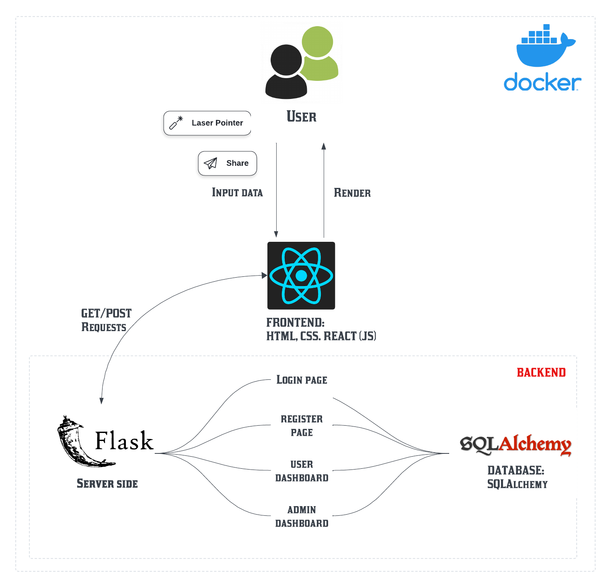

# Audio Application

A simple React and Flask app designed to showcase user authentication and facilitate database usage for uploading audio files.

# Prerequisites

To run this application, you need the following technologies installed:

1. **React**
2. **Python (Flask)**
3. **Docker**

# Features

| Feature           | User | Admin |
| ----------------- | ---- | ----- |
| User Registration | ✅   |       |
| User Login        | ✅   |       |
| Add Audio         | ✅   |       |
| Delete Audio      | ✅   |       |
| Play Audio        | ✅   |       |
| Create Account    |      | ✅    |
| Delete Account    |      | ✅    |
| Update Account    |      | ✅    |
| Create New Admins |      | ✅    |
| Create New Users  |      | ✅    |

## Setup

### Clone project:

```bash
git clone https://github.com/jchkiyo/audio-app.git
cd audio-app
```

## Run project:

Change backend and frontend port to your local machine if needed, look at docker-compose on how.

Pull images:

```bash
docker pull jchkiyo/audio-app-frontend:latest
docker pull jchkiyo/audio-app-backend:latest
docker-compose up
```

Rebuild if pulled images dont work

```bash
# Set the environment variable in PowerShell
$env:REACT_APP_API_URL = "http://localhost:50000"

# Build and run the Docker Compose services
docker-compose up --build
```

# System Architecture



## Login Page

- **Incorrect Credentials**: Prompts error on incorrect credentials.
- **Register Navigation**: Clicking "Register" navigates to the register page.
- **Admin Dashboard Navigation**: Logging in with an admin account navigates to the admin dashboard page.
- **User Dashboard Navigation**: Logging in with a user account navigates to the user dashboard page.

**Default Admin Account (case sensitive)**:

- **Username**: admin
- **Password**: password

## Register Page

- **Default User Role**: New accounts are assigned the "user" role, preventing access to the admin dashboard.
- **Username Uniqueness**: Prompt error if trying to register with an already used username.
- **Same Passwords**: Users can create different accounts with the same password.
- **Back Navigation**: Users can click back to navigate to the login page.

### Things to Improve

- Password should have a minimum character requirement.
- Password should be alphanumerical and contain symbols.

## Admin Dashboard Features

- **Create User**: Admin can create either admin or user accounts.
- **Edit User**: Admin can click edit on any row to change the user's password.
- **Search Functionality**: Admin can use the search bar to find specific user accounts.
- **Delete Accounts**: Admin can delete user/admin accounts.
- **Prevent Last Admin Deletion**: Admin cannot delete the last remaining admin account.
- **Logout Functionality**: Admin can logout, losing their token.

### Things to Improve

- Username can't be changed via the edit feature; deletion and recreation is required.

## User Dashboard Features

- **Upload Audio**: Users can upload audio files, filling in optional descriptions and categories. Error is prompted for non-audio files.
- **File Upload Icons**: Two icons are available—one for uploading files, another for viewing uploaded audio files.
- **File Actions**: Users can choose audio files to play or delete. Deleting removes files from the list, and playing opens an audio player.
- **Logout Functionality**: Users can logout and will be redirected to the login page. Unauthorized access will deny visibility of audio files.

### Things to Improve

- Sorting by description and category.
- Implementing a search bar.
- Ensure the audio player stops when navigating back to the upload view.

# Development

## Rebuild images:

### Backend:

```bash
cd backend
docker build -t audio-app-backend .
```

### Frontend:

```bash

cd ../frontend
docker build -t audio-app-frontend .
```

### After building, you can verify the images with:

```bash
docker images
```

### Run images:

```bash
docker run -d \
 --name audio-app-backend \
 -p 5000:5000 \
 -e JWT_SECRET_KEY='your-secure-key' \
 -e UPLOAD_FOLDER='uploads/audio' \
 audio-app-backend

docker run -d \
 --name audio-app-frontend \
 -p 3000:3000 \
 -e REACT_APP_API_URL=http://localhost:5000 \
 audio-app-frontend
```

### Run container in interactive mode:

```bash
docker exec -it <name_of_container> /bin/sh
```

# Uploading Docker Images to Docker Hub

To upload your Docker images to Docker Hub, follow these steps:

```bash
docker login
```

```bash
docker tag audio-app-frontend jchkiyo/audio-app-frontend:latest
docker tag audio-app-backend jchkiyo/audio-app-backend:latest
```

```bash
docker push jchkiyo/audio-app-frontend:latest
docker push jchkiyo/audio-app-backend:latest
```
